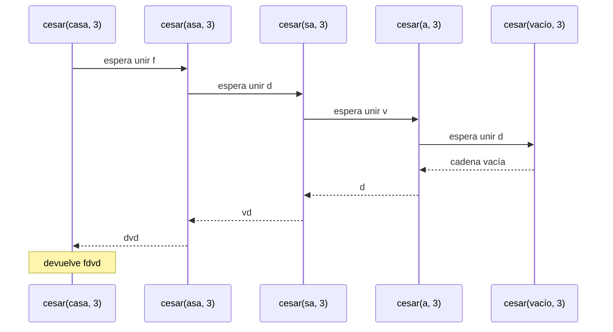
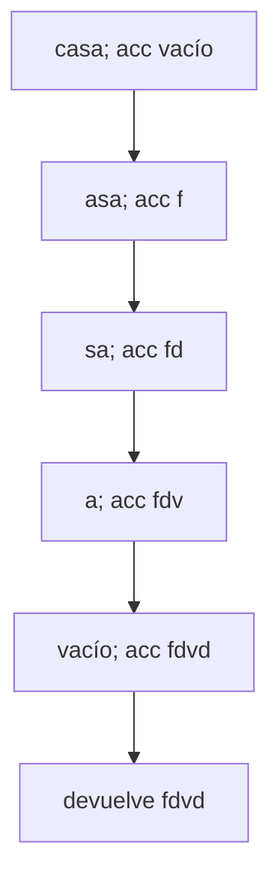
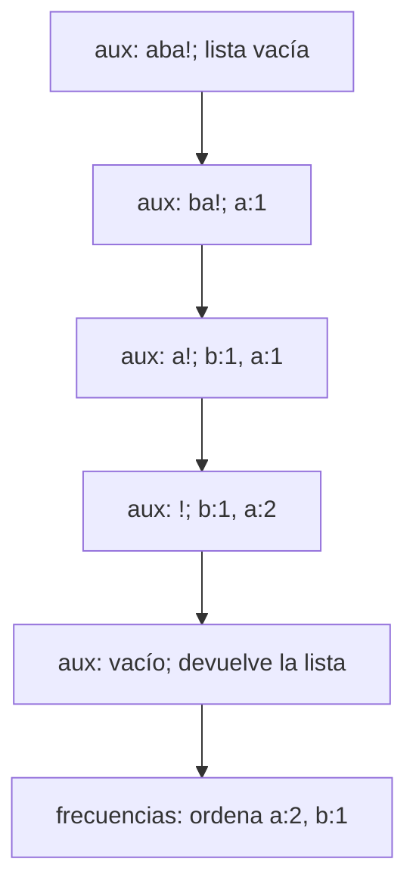
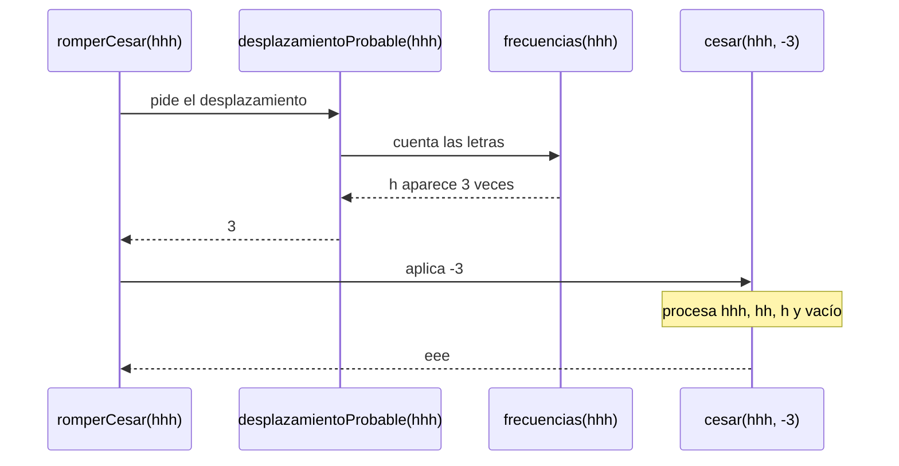
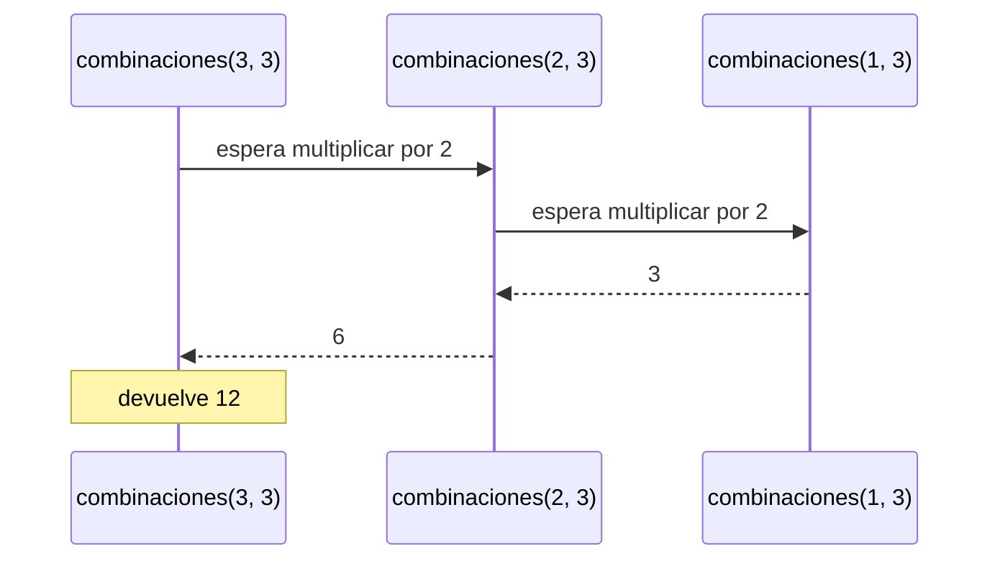
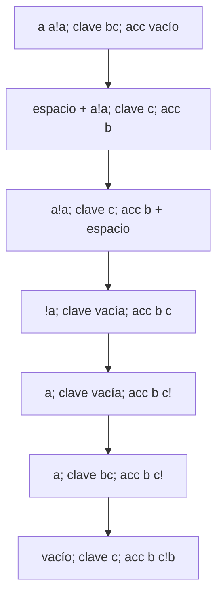

# Informe de proceso — Taller 1: Cifrados clásicos

Fundamentos de Programación Funcional y Concurrente.

## 1. César con recursión lineal

### Definición del algoritmo

```scala
def cesar(m: Mensaje, k: Int): Mensaje =
  if (m.isEmpty) ""
  else desplazar(m.head, k).toString + cesar(m.tail, k)
```

`m` es el mensaje y `k` es el desplazamiento. `head` toma el primer
carácter y `tail` obtiene el resto.

La función cifra solo las minúsculas de `a` a `z`. Los demás caracteres
se conservan. Primero comprueba si el mensaje está vacío, antes de usar
`head` o `tail`.

### Caso base

Si `m` está vacío, devuelve `""`.

### Caso recursivo

Se cifra el primer carácter y se llama a `cesar` con el resto.
La unión queda pendiente hasta que esa llamada termine.

### Llamados paso a paso

Para `cesar("casa", 3)`:

```text
cesar("casa", 3) → "f" + cesar("asa", 3)
cesar("asa", 3)  → "d" + cesar("sa", 3)
cesar("sa", 3)   → "v" + cesar("a", 3)
cesar("a", 3)    → "d" + cesar("", 3)
cesar("", 3)    → ""
```

Al llegar al caso base hay cinco llamadas de `cesar` en la pila.
Las cuatro anteriores esperan para unir su letra con el resultado.

Después se resuelven en este orden:

```text
cesar("a", 3)    → "d" + ""    → "d"
cesar("sa", 3)   → "v" + "d"   → "vd"
cesar("asa", 3)  → "d" + "vd"  → "dvd"
cesar("casa", 3) → "f" + "dvd" → "fdvd"
```

### Diagrama de llamados



La pila crece porque cada llamada tiene una unión pendiente.
Para un mensaje de $n$ caracteres se alcanzan $n+1$ llamadas activas,
contando el caso vacío.

## 2. César con recursión de cola

### Definición del algoritmo

```scala
@tailrec
final def cesarCola(m: Mensaje, k: Int, acc: Mensaje = ""): Mensaje =
  if (m.isEmpty) acc
  else cesarCola(m.tail, k, acc + desplazar(m.head, k))
```

`acc` guarda el resultado parcial. Si no se indica otro valor, comienza
vacío. La anotación `@tailrec` comprueba que la llamada recursiva pueda
ejecutarse sin acumular llamadas en la pila.

### Caso base

Cuando no queda mensaje, se devuelve `acc`.

### Caso recursivo

Se cifra el primer carácter y se agrega al acumulador antes de continuar
con el resto. Después de la llamada no queda ninguna unión pendiente.

### Llamados paso a paso

Para `cesarCola("casa", 3)`:

```text
cesarCola("casa", 3, "")
→ cesarCola("asa", 3, "f")
→ cesarCola("sa", 3, "fd")
→ cesarCola("a", 3, "fdv")
→ cesarCola("", 3, "fdvd")
→ "fdvd"
```

| Paso | Mensaje restante | Acumulador |
|---|---|---|
| 1 | `"casa"` | `""` |
| 2 | `"asa"` | `"f"` |
| 3 | `"sa"` | `"fd"` |
| 4 | `"a"` | `"fdv"` |
| 5 | `""` | `"fdvd"` |

### Diagrama de estados

Las cajas representan distintos momentos de un mismo marco de pila,
es decir, del espacio usado por la llamada.



Scala reutiliza ese marco porque la llamada recursiva es la última
operación. La pila de esta función permanece constante, aunque el
acumulador crece con el resultado.

## 3. Conteo de frecuencias

### Funcionamiento

`frecuencias` usa el auxiliar `aux` para recorrer el mensaje.
Su estado contiene `RestoPalabra` y la lista `acc`.

En cada paso:

- Si el carácter no es minúscula, continúa sin cambiar la lista.
- Si es minúscula, `exists` comprueba si ya está registrada.
- Si existe, `map` aumenta su cantidad.
- Si no existe, se agrega `(letra, 1)` al inicio.

Al terminar, `sortBy` ordena las parejas por cantidad descendente
y por letra ascendente cuando hay empate.

### Pasos de `frecuencias("aba!")`

| Paso | Texto restante | `acc` | Acción |
|---|---|---|---|
| 1 | `"aba!"` | `List()` | Agrega `('a', 1)` |
| 2 | `"ba!"` | `List(('a', 1))` | Agrega `('b', 1)` al inicio |
| 3 | `"a!"` | `List(('b', 1), ('a', 1))` | Aumenta la cantidad de `a` |
| 4 | `"!"` | `List(('b', 1), ('a', 2))` | Ignora el signo |
| 5 | `""` | `List(('b', 1), ('a', 2))` | Devuelve la lista |

Después de ordenar:

```text
List(('a', 2), ('b', 1))
```

### Pila del recorrido

`frecuencias` espera a que termine `aux` para ordenar la lista.
Dentro de `aux`, la siguiente llamada es la última operación y
`@tailrec` permite reutilizar su marco.



`exists` y `map` terminan antes de pasar al siguiente estado.
Por eso no quedan llamadas de `aux` esperando una operación posterior.

## 4. Estimar y romper César

### `desplazamientoProbable("hhh")`

1. Llama a `frecuencias("hhh")`.
2. Recibe `List(('h', 3))`.
3. Toma `h`, la primera letra de la lista.
4. Calcula la distancia desde `e` hasta `h`.
5. Devuelve `3`.

Mientras se cuentan las letras, `desplazamientoProbable` espera.
Cuando recibe la lista, hace el cálculo y termina.
Si la lista está vacía, devuelve `0`.

### `romperCesar("hhh")`

Primero obtiene el desplazamiento `3`. Después llama a
`cesar("hhh", -3)`:

```text
cesar("hhh", -3) → "e" + cesar("hh", -3)
cesar("hh", -3)  → "e" + cesar("h", -3)
cesar("h", -3)   → "e" + cesar("", -3)
cesar("", -3)   → ""
```

Al regresar se forman `"e"`, `"ee"` y `"eee"`.

En el caso base hay cuatro llamadas de `cesar`, además de
`romperCesar`, que espera la respuesta.



## 5. Combinaciones y Vigenère

### 5.1. `combinaciones(3, 3)`

Cada llamada deja pendiente una multiplicación:

```text
combinaciones(3, 3) → 2 * combinaciones(2, 3)
combinaciones(2, 3) → 2 * combinaciones(1, 3)
combinaciones(1, 3) → 3
```

En ese momento hay tres llamadas en la pila.
Al regresar:

```text
combinaciones(2, 3) → 2 * 3 → 6
combinaciones(3, 3) → 2 * 6 → 12
```



Si la longitud es cero, devuelve uno directamente, porque existe
un solo mensaje vacío.

### 5.2. `vigenere("a a!a", "bc")`

La letra `b` de la clave desplaza una posición y `c`, dos.
El auxiliar guarda el mensaje restante, la clave restante y `acc`.

| Paso | `resto` | `claveRestante` | `acc` | Acción |
|---|---|---|---|---|
| 1 | `"a a!a"` | `"bc"` | `""` | Cifra `a` como `b` |
| 2 | `" a!a"` | `"c"` | `"b"` | Copia el espacio |
| 3 | `"a!a"` | `"c"` | `"b "` | Cifra `a` como `c` |
| 4 | `"!a"` | `""` | `"b c"` | Copia `!` |
| 5 | `"a"` | `""` | `"b c!"` | Reinicia la clave |
| 6 | `"a"` | `"bc"` | `"b c!"` | Cifra `a` como `b` |
| 7 | `""` | `"c"` | `"b c!b"` | Devuelve `acc` |

El espacio y el signo no consumen clave. Al reiniciarla, el mensaje
queda igual y se procesa en la siguiente llamada.

### Pila de Vigenère

`vigenere` espera la respuesta de `aux`. Las llamadas del auxiliar
son de cola y reutilizan el mismo marco:



Cuando no queda mensaje, devuelve `"b c!b"`.
Si la clave está vacía desde el inicio, se devuelve el mensaje original
sin llamar al auxiliar.