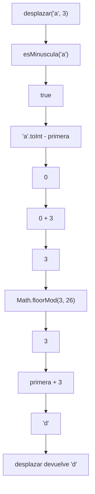
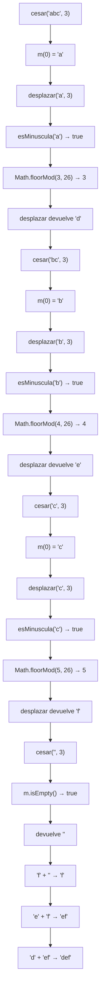

# Proceso — Taller 1: Cifrados Clásicos

## 1. Funciones auxiliares

Antes de explicar las funciones principales del cifrado César, es necesario
explicar las funciones y valores auxiliares que intervienen durante su
ejecución.

---

## 1.1. `letras`

```scala
val letras = 26
```

`letras` representa la cantidad de caracteres del alfabeto inglés utilizado
por el cifrado.

Su valor es `26`, por lo que las posiciones válidas del alfabeto son:

```text
0, 1, 2, ..., 25
```

Este valor se utiliza posteriormente en `Math.floorMod` para mantener el
resultado dentro de ese rango.

---

## 1.2. `primera`

```scala
val primera = 'a'.toInt
```

`primera` almacena el valor entero correspondiente al carácter `'a'`.

Se utiliza para convertir una letra del alfabeto en una posición relativa
entre `0` y `25`.

Por ejemplo:

```text
'a'.toInt - primera → 0
'b'.toInt - primera → 1
'c'.toInt - primera → 2
```

De esta manera, cada letra puede tratarse como una posición dentro del
alfabeto.

---

## 1.3. Función `esMinuscula`

La función es:

```scala
def esMinuscula(c: Char): Boolean =
  c >= 'a' && c <= 'z'
```

Esta función recibe un carácter y determina si pertenece al conjunto de
letras minúsculas del alfabeto inglés.

Ejemplos:

```text
esMinuscula('a') → true
esMinuscula('m') → true
esMinuscula('z') → true

esMinuscula('A') → false
esMinuscula('1') → false
esMinuscula(' ') → false
```

Su resultado es utilizado por `desplazar` para decidir si el carácter debe
ser cifrado o mantenerse sin modificaciones.

---

## 1.4. Función `desplazar`

La función es:

```scala
def desplazar(letra: Char, k: Int): Char =
  if(esMinuscula(letra))
    (primera + Math.floorMod(letra - primera + k, letras)).toChar
  else letra
```

Esta función recibe:

- `letra`: carácter que se quiere desplazar.
- `k`: cantidad de posiciones que se debe desplazar.

Su función es realizar el desplazamiento correspondiente a una letra del
alfabeto.

Primero se verifica:

```scala
esMinuscula(letra)
```

Si el carácter es una letra minúscula, se calcula su nueva posición.

Si no lo es, se ejecuta:

```scala
else letra
```

por lo que el carácter se devuelve sin cambios.

### Ejecución de `desplazar('a', 3)`

El proceso puede representarse mediante el siguiente diagrama:



Por lo tanto:

```text
desplazar('a', 3) → 'd'
```

---

## 1.5. ¿Por qué se utiliza `Math.floorMod`?

En el cifrado César, la posición final de una letra debe estar siempre entre
`0` y `25`.

La función utiliza:

```scala
Math.floorMod(valor, 26)
```

para garantizar esto.

Cuando el valor es positivo, `Math.floorMod` puede producir el mismo
resultado que `%`.

Por ejemplo:

```text
28 % 26 → 2
Math.floorMod(28, 26) → 2
```

Sin embargo, el desplazamiento `k` también puede ser negativo.

Por ejemplo, para desplazar `'a'` tres posiciones hacia atrás:

```text
'a' → posición 0

0 + (-3) = -3
```

Con `%`:

```text
-3 % 26 → -3
```

El resultado es negativo y no corresponde a una posición válida del
alfabeto.

Con `Math.floorMod`:

```text
Math.floorMod(-3, 26) → 23
```

La posición `23` corresponde a `'x'`.

Por lo tanto:

```text
desplazar('a', -3) → 'x'
```

Así, `Math.floorMod` permite que los desplazamientos funcionen
correctamente tanto hacia adelante como hacia atrás.

---

## 1.6. Vuelta al inicio del alfabeto

`Math.floorMod` también permite que el desplazamiento vuelva al comienzo del
alfabeto cuando se supera la posición `25`.

Por ejemplo:

```text
'z' → posición 25

25 + 3 = 28
```

Entonces:

```text
Math.floorMod(28, 26) → 2
```

La posición `2` corresponde a `'c'`.

Por lo tanto:

```text
desplazar('z', 3) → 'c'
```

El alfabeto se comporta de forma circular:

```text
... x → y → z → a → b → c ...
```

---

## 1.7. Caracteres que no se cifran

La condición:

```scala
if(esMinuscula(letra))
```

hace que solamente las letras minúsculas entre `'a'` y `'z'` sean
cifradas.

Cuando el carácter no pertenece a este rango, se ejecuta:

```scala
else letra
```

Por ejemplo:

```text
desplazar('A', 3) → 'A'
desplazar(' ', 3) → ' '
desplazar('1', 3) → '1'
desplazar('.', 3) → '.'
```

De esta forma, los caracteres diferentes de las letras minúsculas se
conservan sin modificaciones.

---

# 2. Cifrado César con recursión lineal

La función implementada es:

```scala
def cesar(m: Mensaje, k: Int): Mensaje =
  if(m.isEmpty()) ""
  else desplazar(m(0), k) + cesar(m.substring(1), k)
```

La función recibe:

- `m`: mensaje que se quiere cifrar.
- `k`: desplazamiento que se aplicará a cada letra.

Su funcionamiento consiste en tomar el primer carácter del mensaje,
cifrarlo mediante `desplazar` y continuar procesando el resto del mensaje.

---

## 2.1. Caso base

El caso base es:

```scala
if(m.isEmpty()) ""
```

Cuando el mensaje está vacío, no quedan caracteres por procesar.

Por ejemplo:

```text
cesar("", 3) → ""
```

La función devuelve una cadena vacía y termina el procesamiento.

---

## 2.2. Procesamiento de un carácter

Cuando el mensaje no está vacío, se obtiene su primer carácter mediante:

```scala
m(0)
```

Por ejemplo:

```text
m = "abc"

m(0) → 'a'
```

Después se utiliza:

```scala
desplazar(m(0), k)
```

Para el ejemplo:

```text
desplazar('a', 3) → 'd'
```

Al mismo tiempo se obtiene el resto del mensaje:

```scala
m.substring(1)
```

Por lo tanto:

```text
"abc".substring(1) → "bc"
```

La función continúa procesando ese nuevo mensaje.

---

## 2.3. Ejecución de `cesar("abc", 3)`

La ejecución comienza con:

```text
cesar("abc", 3)
```

El mensaje no está vacío.

Se obtiene:

```text
m(0) → 'a'
```

Entonces se ejecuta:

```text
desplazar('a', 3)
```

que devuelve:

```text
'd'
```

El resto del mensaje es:

```text
"abc".substring(1) → "bc"
```

Por lo tanto, en este punto queda pendiente construir:

```text
'd' + resultado de cesar("bc", 3)
```

### Segundo paso

Ahora se procesa:

```text
cesar("bc", 3)
```

Se obtiene:

```text
m(0) → 'b'
```

Se ejecuta:

```text
desplazar('b', 3) → 'e'
```

Y el resto del mensaje es:

```text
"bc".substring(1) → "c"
```

Queda pendiente:

```text
'e' + resultado de cesar("c", 3)
```

### Tercer paso

Ahora:

```text
cesar("c", 3)
```

Se obtiene:

```text
m(0) → 'c'
```

Se ejecuta:

```text
desplazar('c', 3) → 'f'
```

Y:

```text
"c".substring(1) → ""
```

Queda:

```text
'f' + resultado de cesar("", 3)
```

### Cuarto paso

Se alcanza el caso base:

```text
cesar("", 3) → ""
```

Ahora comienzan a resolverse las operaciones que habían quedado
pendientes.

```text
cesar("c", 3)
→ 'f' + ""
→ "f"
```

Después:

```text
cesar("bc", 3)
→ 'e' + "f"
→ "ef"
```

Finalmente:

```text
cesar("abc", 3)
→ 'd' + "ef"
→ "def"
```

Por lo tanto:

```text
cesar("abc", 3) → "def"
```

---

## 2.4. Estado de la pila durante `cesar`

En el primer nivel se tiene:

```text
┌────────────────────────────────┐
│ cesar("abc", 3)                │
│ pendiente: 'd' + resultado    │
└────────────────────────────────┘
```

Después:

```text
┌────────────────────────────────┐
│ cesar("abc", 3)                │
│ pendiente: 'd' + resultado    │
├────────────────────────────────┤
│ cesar("bc", 3)                 │
│ pendiente: 'e' + resultado    │
└────────────────────────────────┘
```

Después:

```text
┌────────────────────────────────┐
│ cesar("abc", 3)                │
│ pendiente: 'd' + resultado    │
├────────────────────────────────┤
│ cesar("bc", 3)                 │
│ pendiente: 'e' + resultado    │
├────────────────────────────────┤
│ cesar("c", 3)                  │
│ pendiente: 'f' + resultado    │
└────────────────────────────────┘
```

Finalmente se llega a:

```text
┌────────────────────────────────┐
│ cesar("abc", 3)                │
│ pendiente: 'd' + resultado    │
├────────────────────────────────┤
│ cesar("bc", 3)                 │
│ pendiente: 'e' + resultado    │
├────────────────────────────────┤
│ cesar("c", 3)                  │
│ pendiente: 'f' + resultado    │
├────────────────────────────────┤
│ cesar("", 3)                   │
│ devuelve ""                    │
└────────────────────────────────┘
```

Después de obtener la cadena vacía, las operaciones pendientes se completan
en orden:

```text
cesar("", 3)   → ""
cesar("c", 3)  → "f"
cesar("bc", 3) → "ef"
cesar("abc", 3) → "def"
```

---

## 2.5. Diagrama de ejecución de `cesar`

El siguiente diagrama muestra las funciones que intervienen durante el
procesamiento:



---

# 3. Cifrado César con recursión de cola

La función implementada es:

```scala
@tailrec
final def cesarCola(
  m: Mensaje,
  k: Int,
  acc: Mensaje = ""
): Mensaje =
  if(m.isEmpty) acc
  else cesarCola(
    m.substring(1),
    k,
    acc + desplazar(m(0), k)
  )
```

La función recibe:

- `m`: mensaje que se está procesando.
- `k`: desplazamiento.
- `acc`: acumulador que almacena el resultado construido hasta ese momento.

El acumulador comienza con:

```text
acc = ""
```

y se va actualizando conforme se procesan las letras.

---

## 3.1. El acumulador `acc`

Al comenzar:

```text
m = "abc"
k = 3
acc = ""
```

Después de procesar `'a'`:

```text
m = "bc"
k = 3
acc = "d"
```

Después de procesar `'b'`:

```text
m = "c"
k = 3
acc = "de"
```

Después de procesar `'c'`:

```text
m = ""
k = 3
acc = "def"
```

El resultado parcial siempre se conserva dentro de `acc`.

---

## 3.2. Caso base

El caso base es:

```scala
if(m.isEmpty) acc
```

Cuando ya no quedan caracteres en el mensaje:

```text
m = ""
```

la función devuelve directamente el acumulador.

Por ejemplo:

```text
cesarCola("", 3, "def")
→ "def"
```

---

## 3.3. Procesamiento de un carácter

Cuando el mensaje no está vacío, se obtiene:

```scala
m(0)
```

y se ejecuta:

```scala
desplazar(m(0), k)
```

El carácter cifrado se agrega al acumulador:

```scala
acc + desplazar(m(0), k)
```

Después se continúa con:

```scala
m.substring(1)
```

Por ejemplo, para:

```text
cesarCola("abc", 3, "")
```

se obtiene:

```text
m(0) → 'a'

desplazar('a', 3) → 'd'

"" + "d" → "d"
```

El siguiente estado es:

```text
cesarCola("bc", 3, "d")
```

---

## 3.4. Ejecución de `cesarCola("abc", 3)`

### Paso 1

Estado inicial:

```text
m = "abc"
k = 3
acc = ""
```

Se procesa:

```text
m(0) → 'a'
```

Luego:

```text
desplazar('a', 3) → 'd'
```

Se actualiza el acumulador:

```text
"" + "d" → "d"
```

El siguiente estado es:

```text
cesarCola("bc", 3, "d")
```

### Paso 2

Ahora:

```text
m = "bc"
k = 3
acc = "d"
```

Se procesa:

```text
m(0) → 'b'
```

Luego:

```text
desplazar('b', 3) → 'e'
```

Se actualiza:

```text
"d" + "e" → "de"
```

El siguiente estado es:

```text
cesarCola("c", 3, "de")
```

### Paso 3

Ahora:

```text
m = "c"
k = 3
acc = "de"
```

Se procesa:

```text
m(0) → 'c'
```

Luego:

```text
desplazar('c', 3) → 'f'
```

Se actualiza:

```text
"de" + "f" → "def"
```

El siguiente estado es:

```text
cesarCola("", 3, "def")
```

### Paso 4

Se alcanza el caso base:

```text
cesarCola("", 3, "def")
→ "def"
```

Por lo tanto:

```text
cesarCola("abc", 3) → "def"
```

---

## 3.5. Estado de la ejecución

Los estados de la función son:

| Paso | `m` | `k` | `acc` |
|---|---|---:|---|
| 1 | `"abc"` | 3 | `""` |
| 2 | `"bc"` | 3 | `"d"` |
| 3 | `"c"` | 3 | `"de"` |
| 4 | `""` | 3 | `"def"` |

En cada paso, `acc` contiene el resultado de las letras que ya fueron
procesadas.

---

## 3.6. Estado de la pila

En el primer paso:

```text
┌───────────────────────────────────┐
│ cesarCola("abc", 3, "")           │
└───────────────────────────────────┘
```

Después:

```text
┌───────────────────────────────────┐
│ cesarCola("bc", 3, "d")           │
└───────────────────────────────────┘
```

Después:

```text
┌───────────────────────────────────┐
│ cesarCola("c", 3, "de")           │
└───────────────────────────────────┘
```

Finalmente:

```text
┌───────────────────────────────────┐
│ cesarCola("", 3, "def")           │
│ devuelve "def"                    │
└───────────────────────────────────┘
```

El resultado parcial se encuentra en `acc` durante todo el proceso.

---

## 3.7. Diagrama de ejecución de `cesarCola`

```mermaid
flowchart TD
    A["cesarCola('abc', 3, '')"] --> B["m.isEmpty() → false"]
    B --> C["m(0) = 'a'"]
    C --> D["desplazar('a', 3)"]
    D --> E["esMinuscula('a') → true"]
    E --> F["Math.floorMod(3, 26) → 3"]
    F --> G["'a' → 'd'"]
    G --> H["'' + 'd' → 'd'"]
    H --> I["cesarCola('bc', 3, 'd')"]

    I --> J["m.isEmpty() → false"]
    J --> K["m(0) = 'b'"]
    K --> L["desplazar('b', 3)"]
    L --> M["esMinuscula('b') → true"]
    M --> N["Math.floorMod(4, 26) → 4"]
    N --> O["'b' → 'e'"]
    O --> P["'d' + 'e' → 'de'"]
    P --> Q["cesarCola('c', 3, 'de')"]

    Q --> R["m.isEmpty() → false"]
    R --> S["m(0) = 'c'"]
    S --> T["desplazar('c', 3)"]
    T --> U["esMinuscula('c') → true"]
    U --> V["Math.floorMod(5, 26) → 5"]
    V --> W["'c' → 'f'"]
    W --> X["'de' + 'f' → 'def'"]
    X --> Y["cesarCola('', 3, 'def')"]

    Y --> Z["m.isEmpty() → true"]
    Z --> AA["devuelve acc = 'def'"]
```



---

## 3.8. ¿Por qué `cesarCola` es recursión de cola?

La parte principal es:

```scala
else cesarCola(
  m.substring(1),
  k,
  acc + desplazar(m(0), k)
)
```

Antes de realizar la llamada se calcula el nuevo valor de `acc`.

Por ejemplo:

```text
acc = "de"

desplazar('c', 3) → 'f'

"de" + "f" → "def"
```

Después se ejecuta:

```text
cesarCola("", 3, "def")
```

La llamada a `cesarCola` queda como la última operación de la función.

Por esta razón se puede utilizar:

```scala
@tailrec
```

La anotación `@tailrec` permite que el compilador compruebe que la función
está escrita correctamente como una función recursiva de cola.